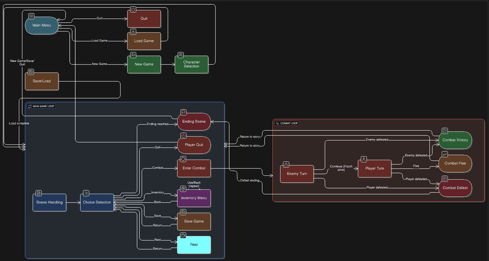

# AI Game 

The **Ai Game** is an interactive program where users can play a game! That's right, this is a game made by Ai only 

---

## Features  
- A working functional game 
- Simple, text-based interface  
- Different endings 
- Educational tool for learning 
- Story

---

## Installation  

1. Clone the repository:  
   ```bash
   git clone https://github.com/Eclipse0-Gum/AI-Game.git
   cd Ai-Game


## Flowchart 

A flow chart of the process:

